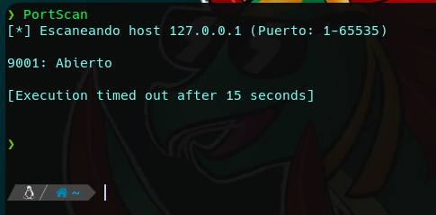

La enumeración de puertos es una tarea crucial en las pruebas de penetración y seguridad de redes. Tal y como hemos visto, Nmap es una herramienta de línea de comandos ampliamente utilizada para esta tarea, pero existen alternativas para realizar la enumeración de puertos de manera efectiva sin utilizar herramientas externas.

Una alternativa a la enumeración de puertos utilizando herramientas externas es aprovechar el poder de los descriptores de archivo en sistemas Unix. Los descriptores de archivo son una forma de acceder y manipular archivos y dispositivos en sistemas Unix. En particular, la utilización de /dev/tcp permite la conexión a un host y puerto específicos como si se tratara de un archivo en el sistema.

Para realizar la enumeración de puertos utilizando /dev/tcp en Bash, es posible crear un script que realice una conexión a cada puerto de interés y compruebe si el puerto está abierto o cerrado en función de si se puede enviar o recibir datos. Una forma de hacer esto es mediante el uso de comandos como “echo” o “cat“, aplicando redireccionamientos al /dev/tcp. El código de estado devuelto por el comando se puede utilizar para determinar si el puerto está abierto o cerrado.




```
package main

import (
	"fmt"
	"flag"
	"context" // Done() struct{} || <- ctx.Done()
	"strings"
	"strconv"
	"log"
	"sync"
	"time"
	"net"
)

var (
	host = flag.String("host", "127.0.0.1", "Host o dirección IP a escanear")
	ports = flag.String("range", "1-65535", "Rango de puertos a comprobar: 80,443,1-65535,1000-2000, ...")
	threads = flag.Int("threads", 1000, "Número de hilos a usar")
	timeout = flag.Duration("timeout", 1*time.Second, "Segundos por puerto")
)

func processRange(ctx context.Context, r string) chan int {
	c := make(chan int) // c <- elemento
	done := ctx.Done()

	go func() {
		defer close(c)
		blocks := strings.Split(r, ",")

		for _, block := range blocks {
			rg := strings.Split(block, "-")
			var minPort, maxPort int
			var err error

			minPort, err = strconv.Atoi(rg[0])

			if err != nil {
				log.Print("No ha sido posible interpretar el rango: ", block)
				continue
			}

			if len(rg) == 1 {
				maxPort = minPort
			} else {
				maxPort, err = strconv.Atoi(rg[1])
				if err != nil {
					log.Print("No ha sido posible interpretar el rango: ", block)
					continue
				}
			}
			for port := minPort; port <= maxPort; port++ {
				select {
				case c <- port:
				case <-done:
					return
				}
			}
		}
	}()
	return c
}

func scanPorts(ctx context.Context, in <-chan int) chan string {
	out := make(chan string)
	done := ctx.Done()
	var wg sync.WaitGroup
	wg.Add(*threads)

	for i := 0; i < *threads; i++ {
		wg.Add(1)
		go func() {
			defer wg.Done()
			for {
				select {
				case port, ok := <-in:
					if !ok {
						return
					}
					s := scanPort(port)
					select {
					case out <- s:
					case <-done:
						return
					}
				case <-done:
					return
				}
			}
		}()
	}
	go func() {
		wg.Wait()
		close(out)
	}()

	return out
}

func scanPort(port int) string {
	addr := fmt.Sprintf("%s:%d", *host, port) // ip:puerto
	conn, err := net.DialTimeout("tcp", addr, *timeout)

	if err != nil {
		return fmt.Sprintf("%d: %s", port, err.Error())
	}

	conn.Close()

	return fmt.Sprintf("%d: Abierto", port)
}

func main() {
	ctx, cancel := context.WithCancel(context.Background()) // Definimos nuestro contexto
	defer cancel()

	flag.Parse()
	fmt.Printf("\n[*] Escaneando host %s (Puerto: %s)\n\n", *host, *ports)

	pR := processRange(ctx, *ports)
	sP := scanPorts(ctx, pR)

	for port := range sP {
		if strings.HasSuffix(port, ": Abierto") {
			fmt.Println(port)
		}
	}
}
```

Aunque esta alternativa puede ser menos precisa y más lenta que el uso de herramientas especializadas como Nmap, es una opción interesante y viable para aquellos que buscan una solución rápida y sencilla para la enumeración de puertos en sistemas Unix. Además, este enfoque puede proporcionar una mejor comprensión de cómo funcionan los descriptores de archivo en los sistemas Unix y cómo se pueden utilizar para realizar tareas de red.
